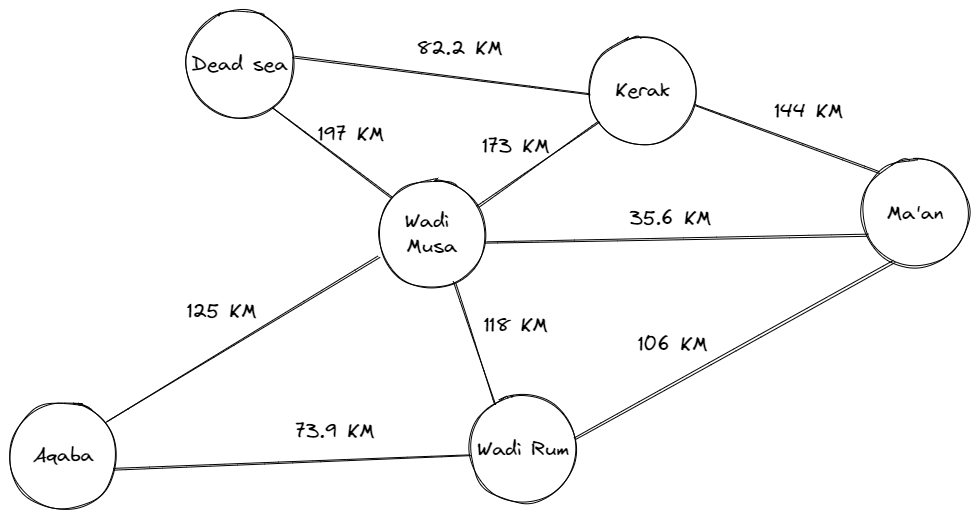

# Jordan Trip

Create a method that take two parameters, a graph and a array of string.
the array is a list of places name in Jordan,
The method should return the cost of the trip (if it’s possible) or null (if not).
## Example

Input: 

First Parameter: array:   
```python
    ["Ma'an", "Wadi Rum", "Aqaba"]
```


Second Parameter: graph:



Output:
```python
    179.9
```